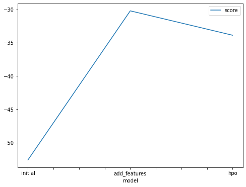
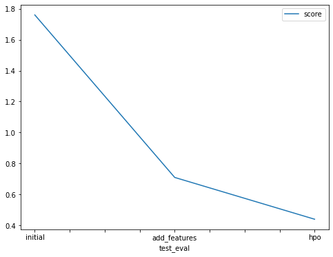

# Report: Predict Bike Sharing Demand with AutoGluon Solution
#### NAME HERE

## Initial Training
### What did you realize when you tried to submit your predictions? What changes were needed to the output of the predictor to submit your results?
it need to remove all the negative number if exist and it shows me my score and my position in leadboard , my first submission was 1.3  wich is too high going to improve model by adding more feature in  the other models

### What was the top ranked model that performed?
My best rank and the hightest was the third predictor which I add  tuning and more feature

## Exploratory data analysis and feature creation
### What did the exploratory analysis find and how did you add additional features?
I add additional feature by changing the datatime column to datatime and add more columns  for year,month,day,hour,minute and second which the score ,aslo changing type of some columns to category 

### How much better did your model preform after adding additional features and why do you think that is?

after splitting our data to  year,month,day,hour,minute and second it improve the model and make the score get higher 

## Hyper parameter tuning
### How much better did your model preform after trying different hyper parameters?
it worked better than first one and  second predictor  , I had to look on  the documentation of hyperparameter of autoglan to take better look on the paramter which could be tuning 
### If you were given more time with this dataset, where do you think you would spend more time?
I think I would try to add more feature and improve the tuning so it could get higher result

### Create a table with the models you ran, the hyperparameters modified, and the kaggle score.
|model|hpo1|
|--|--|
|initial|1.79|
|add_features|0.71|
|hpo|0.44|

### Create a line plot showing the top model score for the three (or more) training runs during the project.

TODO: Replace the image below with your own.

### Create a line plot showing the top kaggle score for the three (or more) prediction submissions during the project.

TODO: Replace the image below with your own.

## Summary
As it shown the more we get  more feature the models start to be better and we need to find the best tuning of our paprmeter so we got the best result